# FeedAI — Pitch Deck Template

A mini AI-driven feed for the micro-businesses tourists walk right past.
Built as a Hackathon prototype. Live in your browser today, scalable to thousands of street-food vendors, tuk-tuk drivers, masseuses and tour guides tomorrow.

> **Stack:** Laravel 13 · Livewire 4 · Flux UI · Tailwind v4 · Anthropic Claude (via Laravel AI SDK) · Spatie Media Library · Stripe Connect Express · PromptPay · Symfony YAML for content
>
> **State:** 212/212 tests green · 7 live demo vendors · 3 locales (EN/DE/TH) round-trip translated · web-app currently runs at `http://localhost:8000`

---

## Slide 1 — Title

**FeedAI**
*A pocket-size feed for the businesses tourists keep walking past.*

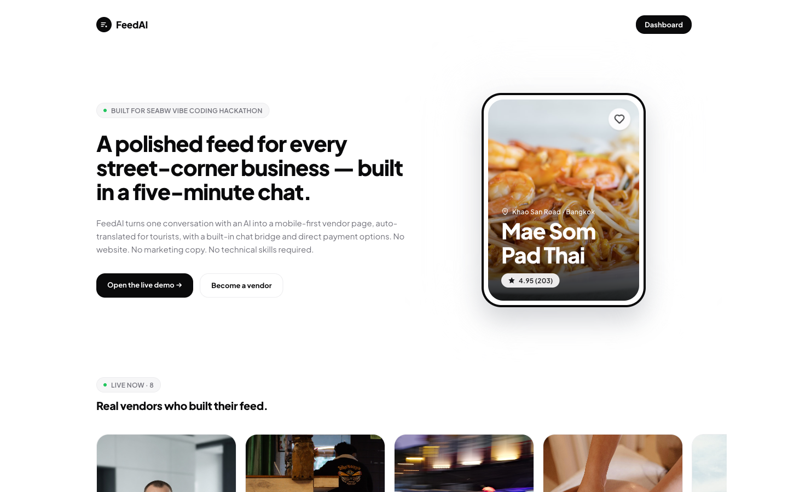
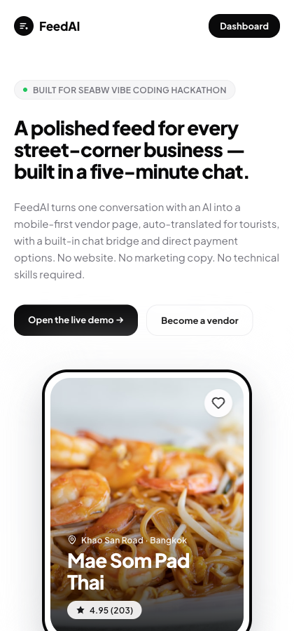

---

## Slide 2 — The Problem

Three things keep micro-businesses invisible to the people walking right past them:

1. **Digital visibility** — phenomenal product, zero web presence. Building a site is too technical, too slow, too expensive.
2. **Language barrier** — vendor speaks Thai, tourist reads German. Even with a page, the gap kills the conversion.
3. **Payment friction** — no card terminal, no merchant account. Tap-and-go tourists walk away.

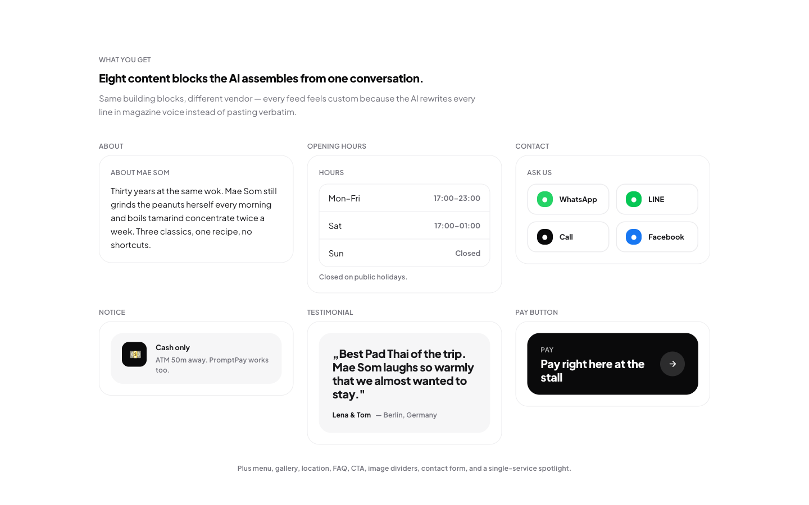

---

## Slide 3 — The Audience

- Bangkok street-food vendors
- Tuk-tuk drivers, taxi & private transfers
- Independent Thai massage studios
- Cultural walking-tour guides
- Klong (canal) boat operators
- Anyone running a one-person-or-family-sized service in a tourist district

---

## Slide 4 — The Solution

A 6-step chat-with-AI onboarding produces a publishable, mobile-first vendor page in **5–10 minutes**, with three keystones built in:

1. **AI-built feed** in the vendor's own language — magazine-grade copy, polished hero photos, eight standard components.
2. **Bidirectional translation** — EN/DE/TH, public surfaces only. Vendor backend stays English so we don't dilute the tool.
3. **Direct payments** — no platform fees, no escrow. Card (Stripe Connect), QR (PromptPay), Crypto (vendor-controlled wallet). FeedAI never holds the money.

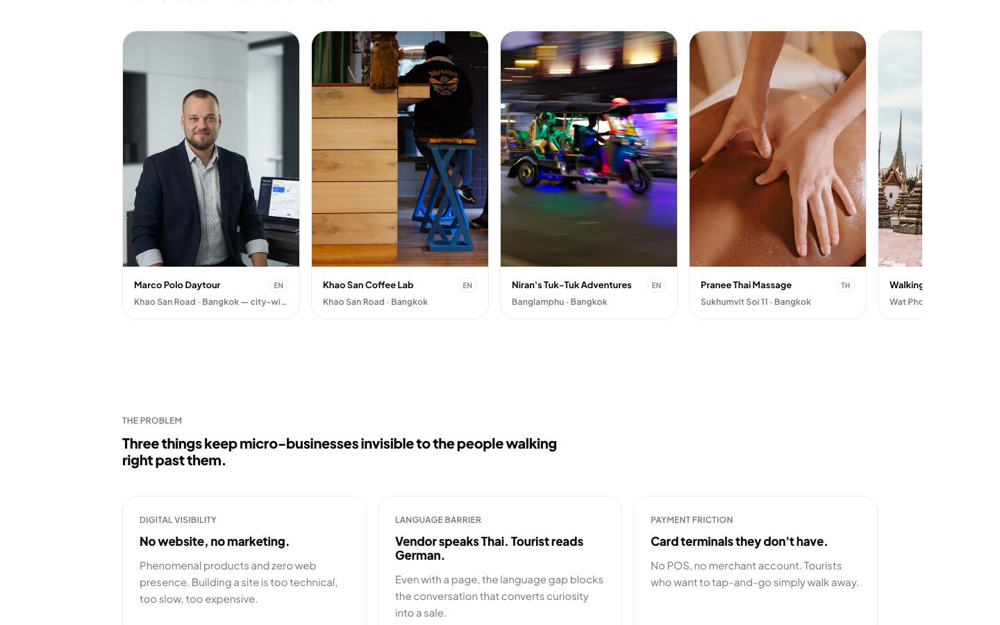
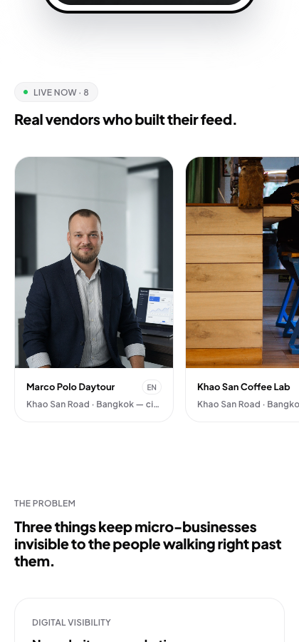

---

## Slide 5 — The Demo Set

A fresh `migrate:fresh --seed` ships with **5 hand-curated example vendors** + 2 inherited demos, so reviewers see a real marketplace, not a single bootstrap example:

| Slug | Persona | Source locale | Voice |
| --- | --- | --- | --- |
| `khao-san-coffee` | Third-wave café | EN | Slow-brewed, Italian-bar precise |
| `niran-tuktuk` | Private tuk-tuk tours | EN | Local insider, 18 years on the handlebars |
| `pranee-thai-massage` | Wellness studio | TH | Wat Pho lineage, three clients at a time |
| `kru-vee-walks` | Cultural walking guide | EN | Retired Thai-history teacher, max-6 groups |
| `sailom-boats` | Long-tail klong boats | TH | Three-generation family, 4-pax private |

Each vendor ships with: User row · Vendor row · vendor.yaml · pages/home.yaml · 8 standard component .md files · all translations regenerated in DE+TH after seeding.

---

## Slide 6 — Vendor Feed (Public View)

What the tourist sees when they scan the vendor's QR code or open the link:

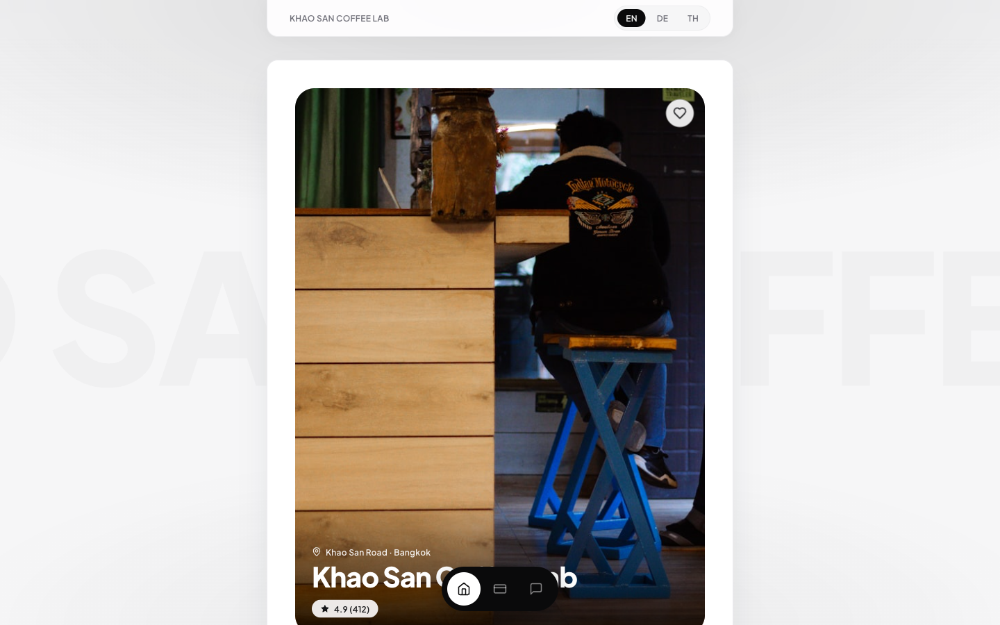
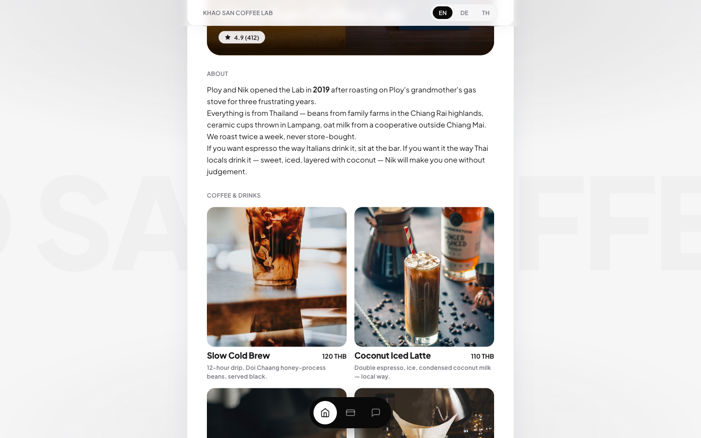
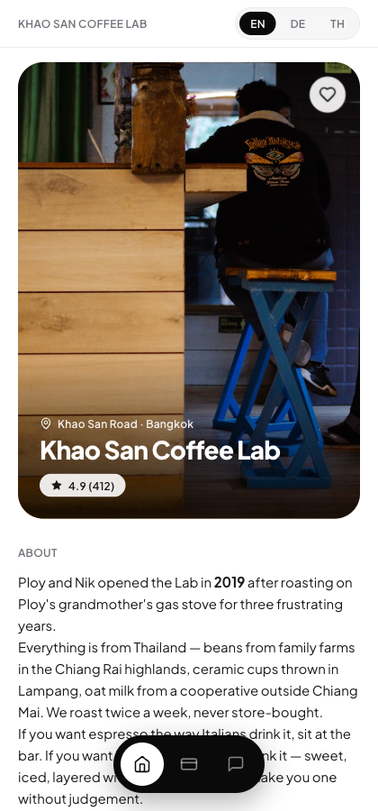
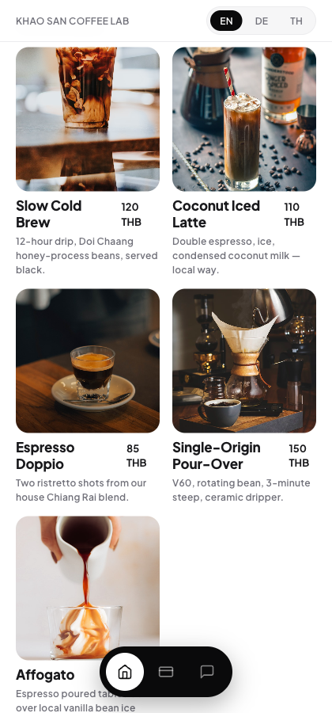
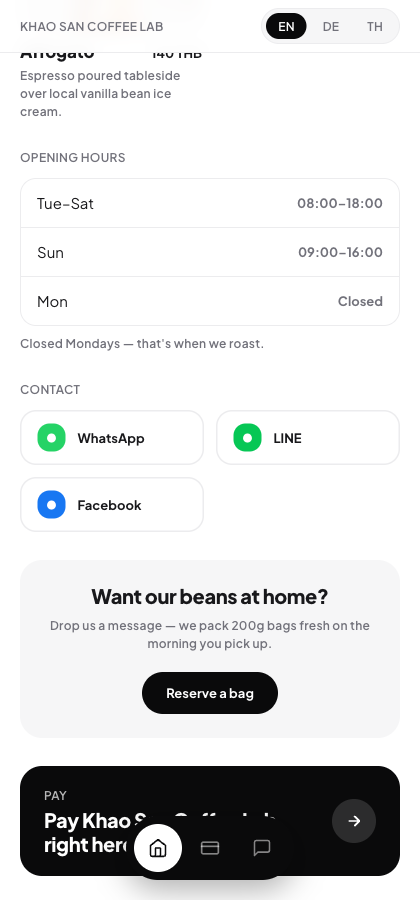

- Eight-component standard feed (hero · about · menu/services · opening hours · contact buttons · CTA · pay-now trigger · contact form).
- Mobile-first layout with a sticky bottom-nav (Home · Pay · Message).
- Locale switcher in the top-right — EN / DE / TH always visible.
- Per-vendor accent colour pulled from `vendor.accent_color`.

---

## Slide 7 — Bidirectional Translation

Every vendor has a *source locale* (the one the vendor speaks). Translations to the other two locales are produced by Claude in a queued job and stored as `storage/app/vendors/{slug}/translations/{locale}/...`. The locale resolution chain is **Query > Cookie > Accept-Language > Vendor > 'en'** so explicit `?lang=de` links always win.

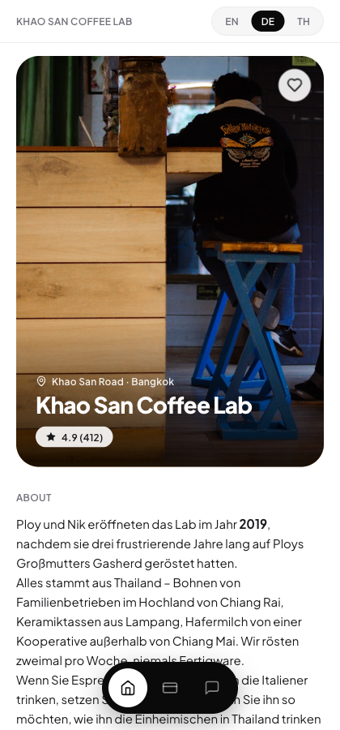
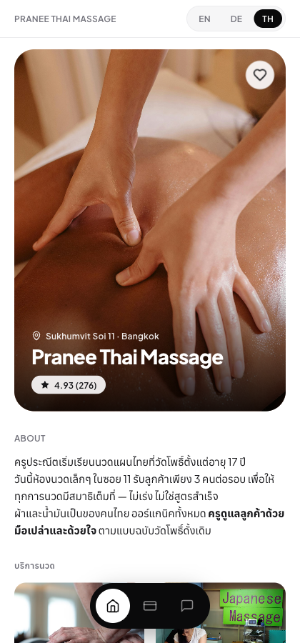

- Vendor backend stays English by design — the tool's UI doesn't get translated, only the public output does.
- Translations regenerate **automatically** every time a component is edited.
- Round-trip works for inbox messages too (vendor reads in their language, tourist reads in theirs).

---

## Slide 8 — The Contact Bridge

The single biggest conversion lever: a tourist can message the vendor *directly inside the page*, and the platform translates both ways in real time.

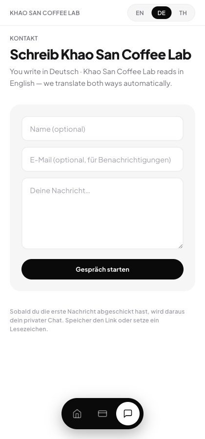

- Anonymous tokenised conversations (no login required for the tourist).
- The chat banner shows live "You write in :you · :name reads in :them" — vendor and tourist always know which way the translation goes.
- All threads roll up into the vendor's dashboard inbox.

---

## Slide 9 — Direct Payments

Three payment rails, all routing the money **directly** to the vendor. No platform escrow, no FeedAI cut.

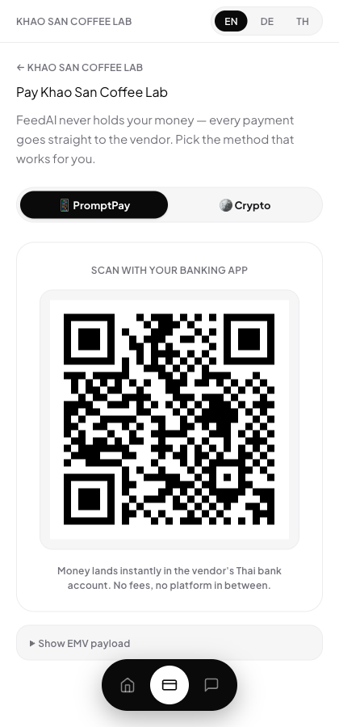

| Rail | Provider | UX | Vendor receives in |
| --- | --- | --- | --- |
| Card | Stripe Connect Express | Hosted checkout | 2–3 business days |
| QR | PromptPay (Thai instant) | Scan with banking app | Instantly |
| Crypto | Vendor's own wallet | Copy address / scan QR | Whenever the chain settles |

- Vendors enable each rail individually in `/dashboard/payments`.
- Demo mode auto-enables on localhost so the pitch works without real keys.

---

## Slide 10 — Vendor Backend (Edit-Mode)

After onboarding, vendors edit their live feed via the same chat agent. The preview iframe on the left updates instantly, and any component is clickable to open a structured form.

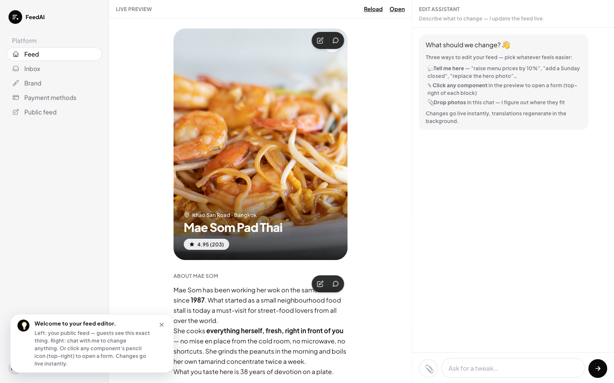
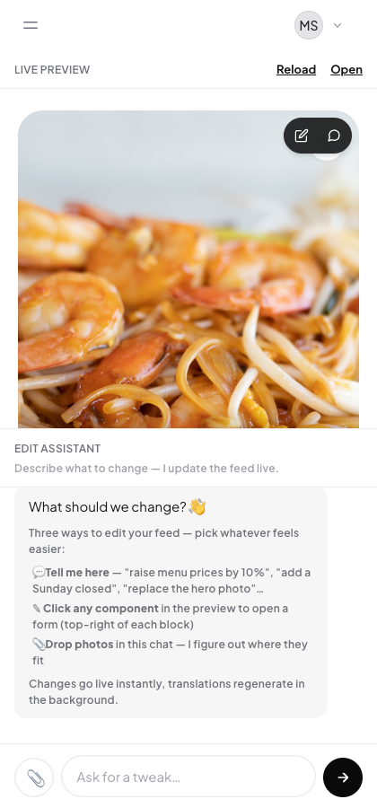

- Three edit paths: **chat** (any natural-language request), **click-a-component** form, **drop-a-photo** in the chat (vision agent auto-routes it).
- Markers in the preview let the vendor "discuss in chat" any specific block.
- Drag-to-reorder and one-click activate/deactivate of optional components.

---

## Slide 11 — Brand & Identity

A single accent colour drives the whole feed: hero overlay, CTA button, locale picker, payment-now button. One control, consistent feel.

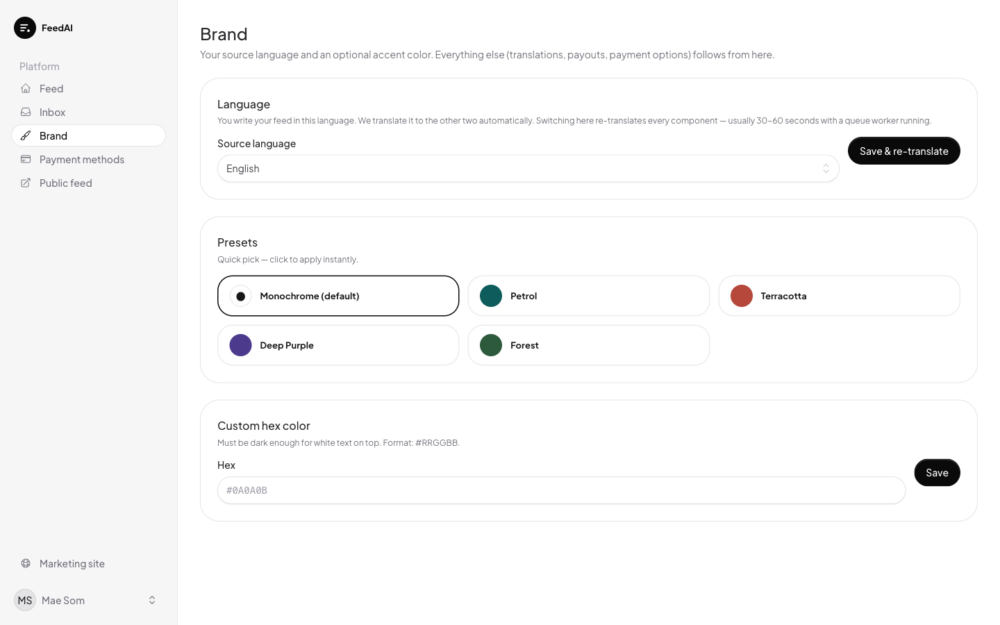

- Logo (FeedAI mark) shown in sidebar to anchor the brand inside the tool.
- Sidebar nav: Feed (was "Dashboard"), Inbox, Payments, Brand.

---

## Slide 12 — Inbox

Every contact-form submission, every tourist message, every translated reply lands in one threaded inbox. Notifications fire instantly via Laravel events.

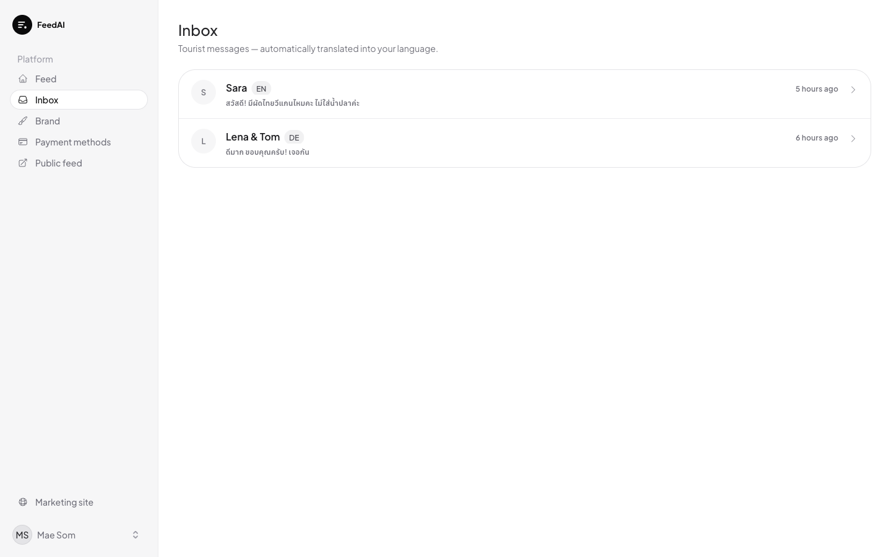
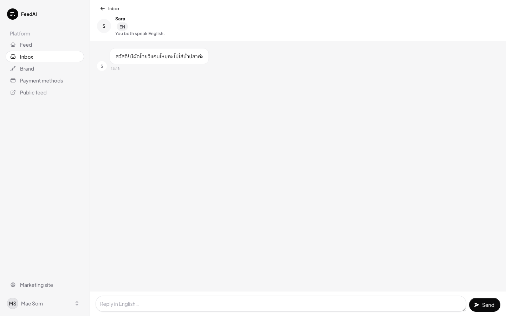

---

## Slide 13 — Payments Settings & Log

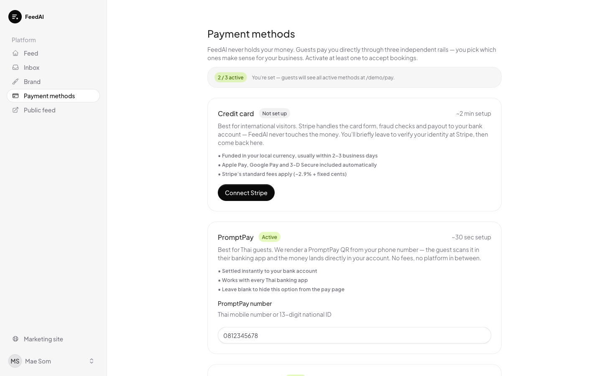

- Stripe Connect Express onboarding flow (vendor authorises FeedAI as platform, money still flows straight to their bank).
- PromptPay phone number stored as a single string; EMV payload generated server-side at request time so no PII leaks.
- Stablecoin address + chain stored on vendor row.

---

## Slide 14 — Tech Highlights

- **Laravel 13 + Livewire 4** keeps state server-side; reactive surface without writing JavaScript.
- **Flux UI 2** for the dashboard chrome, **Tailwind v4** with semantic `@theme` tokens for everything else.
- **Laravel AI SDK + Anthropic Claude Sonnet 4.6** powers two distinct agents: `OnboardingAgent` (6-phase build) and `EditAgent` (free-form edit).
- **Component schemas in YAML** (`config/feedai/component-schemas/*.yaml`) so adding a new component type is one file + one Blade partial.
- **Spatie Media Library** stores every photo, post-upload `AnalyzeImage` job tags it with description / alt-text / suggested-intent via Claude Vision.
- **Symfony YAML** as the content format; vendor data lives entirely on disk under `storage/app/vendors/{slug}/` so every feed is portable / exportable.
- **Queued translation jobs** mean edits feel instant in the dashboard while DE/TH copies rebuild in the background.

---

## Slide 15 — What's Next

- **Vendor onboarding via QR-code-from-a-flyer** (printable handout that links straight to the chat).
- **Booking + paid slots** (calendar + Stripe upfront) for tour guides and massage studios.
- **Customer profiles** so tourists can save their language preference + favourite vendors.
- **Reviews + ratings**, fed back into the magazine voice ("4.9 average over 412 visits").
- **Multi-page feeds** (vendor can build sub-pages for menu deep-dives, gallery, FAQ).
- **Public marketplace search** at `/explore?lang=de&kind=massage&area=sukhumvit`.

---

## Slide 16 — Why It Wins

| Today | With FeedAI |
| --- | --- |
| Vendor: "I have Facebook only" | Live publishable feed in 5–10 minutes |
| Tourist sees no English | Auto-translated to their language |
| Tourist can't message | Translation bridge built into the page |
| Vendor has no card terminal | Stripe + PromptPay + Crypto, no platform fee |
| Vendor has no website to share | One link, one QR code, on every flyer |

---

*Generated 2026-05-20 alongside the demo seed. All screenshots produced by Playwright against the running dev server at `http://localhost:8000`.*
